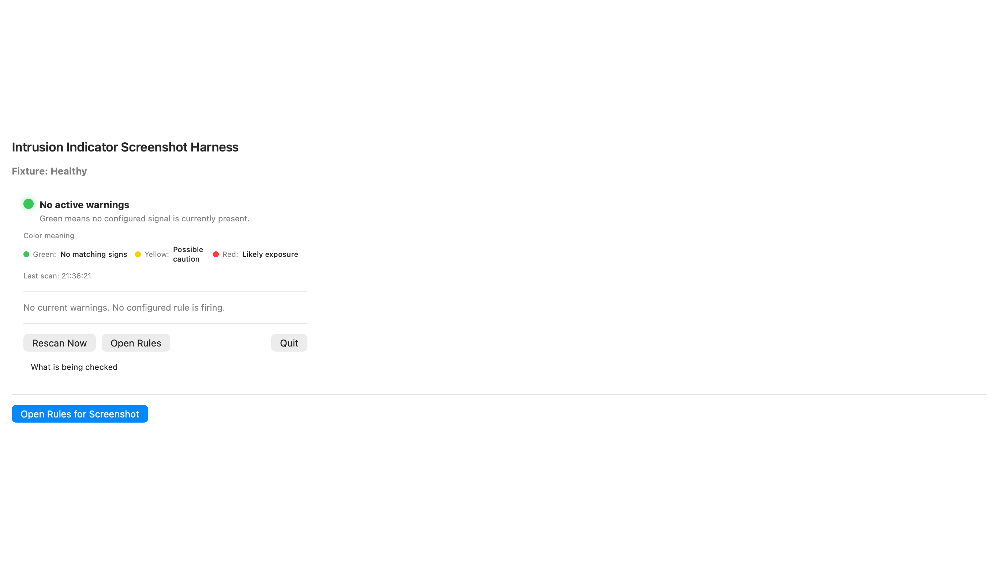
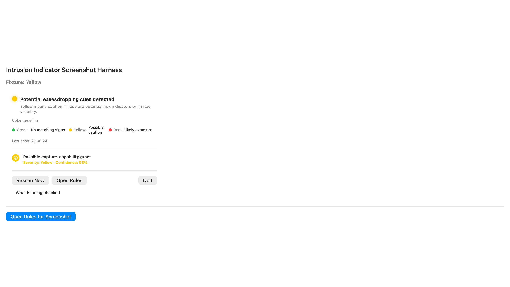

# Intrusion Indicator

[](https://developer.apple.com/macos/)
[](https://www.swift.org/)
[](https://github.com/albertbuchard/intrusion-indicator/actions/workflows/deploy-gh-pages.yml)
[](https://github.com/albertbuchard/intrusion-indicator/releases)
[](LICENSE)
[](https://github.com/albertbuchard/intrusion-indicator/stargazers)

**Intrusion Indicator** is an open-source macOS menubar utility that helps you see possible signs of remote visual/audio access in real time. It is built around **local analysis only**: signals are gathered from local system state and evaluated in-app, with no background upload or third-party telemetry.

## Why this project is open source

- Fully transparent: rule engine and logic are inspectable in source.
- Privacy-first by design: no cloud submission of detections or captured media.
- Built for trust: every warning is accompanied by explanation text and evidence.
- Community-friendly: anyone can read, audit, improve, or extend signals and trust rules.

## What the app detects

- Screen-sharing and remote management service activity
- Camera, microphone, and screen permission changes
- Process and listener patterns commonly associated with remote sessions
- Network listener/endpoint exposure
- Known suspicious process families and suspicious startup behavior

Every finding includes:

- severity (color coded and sorted by confidence)
- a concise rule name
- why it triggered
- recommended next steps

## Color semantics

- 🟢 `Green`: no active risk signals detected
- 🟡 `Yellow`: weak / suspicious hints; review recommended
- 🔴 `Red`: strong indicators that likely deserve immediate review

## Screenshots

| Menu status and alerts | Trust model and rules | Detailed finding card |
|---|---|---|
|  |  |  |

## Getting started

### 1. Requirements

- macOS 13+
- Xcode 15+
- Apple developer tools installed (Command Line Tools)

### 2. Build in Xcode

```bash
git clone https://github.com/albertbuchard/intrusion-indicator.git
cd intrusion-indicator
open IntrusionIndicator.xcodeproj
```

1. Choose the `IntrusionIndicator` scheme
2. Select a macOS simulator or your local machine
3. Click **Run**

### 3. Run from CLI

```bash
xcodebuild -project IntrusionIndicator.xcodeproj \
  -scheme IntrusionIndicator \
  -configuration Debug \
  -destination 'platform=macOS'
```

## Project layout

- `IntrusionIndicator/` — SwiftUI app code, collectors, models, and menubar UI
- `IntrusionIndicatorTests/` — unit tests for rule logic
- `IntrusionIndicatorUITests/` — UI regression and menu-window checks
- `scripts/` — build/release helper scripts
- `docs/` — process notes and publishing information

## Detection rules, trust, and transparency

Detections are defined as readable local rules and run entirely on-device.  
You can inspect or extend these signals in the UI, and trust exceptions are managed via the in-app trust list.

- Trust list entries lower false positives for known tools.
- Rules can be reviewed from within the app and are designed to be explainable first.
- Debug logs are local and explicit when enabled.

For privacy scope and permissions rationale, see [`docs/privacy.md`](docs/privacy.md).

## Contributing

This project is open to contributions from users and engineers who care about privacy tooling.

- Open an issue for bugs, feature ideas, or false positives.
- Keep detector changes conservative by default.
- Include reproduction steps and reasoning in PR descriptions.

## License

This repository is released under the [MIT License](LICENSE).

## Community

- Issue tracker: https://github.com/albertbuchard/intrusion-indicator/issues
- Pull requests: https://github.com/albertbuchard/intrusion-indicator/pulls

